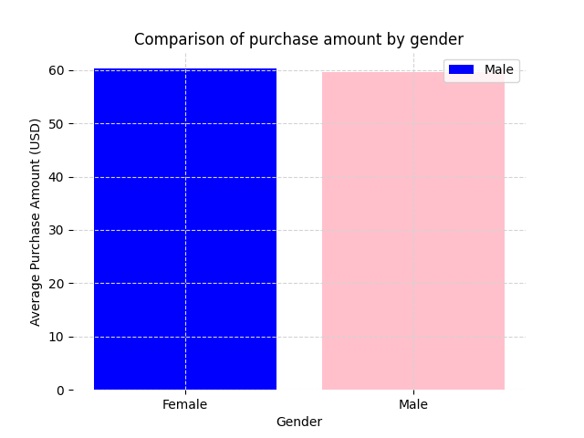
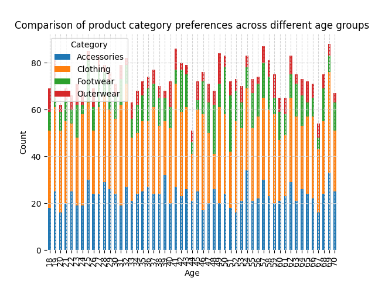
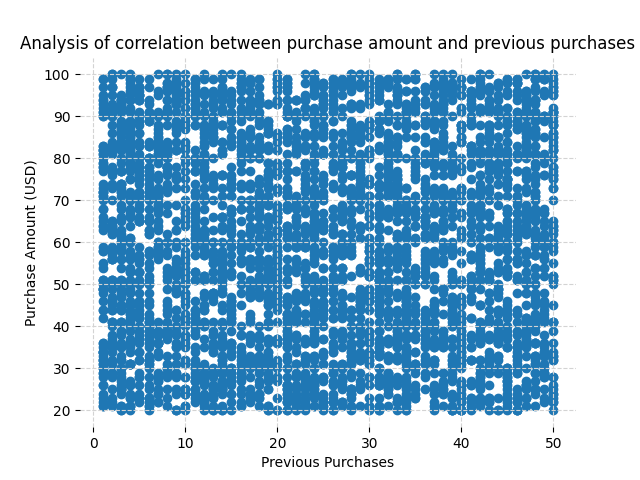

# 数据分析报告

## {'title': 'Analysis of Differences in Shopping Behavior by Gender'}

## {'title': 'Comparison of Purchase Preferences Across Different Age Groups'}

> This stacked bar chart breaks down product category preferences (Clothing, Accessories, Footwear, and Outerwear) by age groups. It reveals that Clothing is consistently the most popular category across all age ranges, with Accessories and Footwear showing steady but slightly varying levels of interest. Outerwear, however, exhibits a smaller share, particularly among younger age groups.

### Chapter Summary

The chapter titled 'Comparison of Purchase Preferences Across Different Age Groups' aims to analyze and compare the product category preferences among customers of varying ages. The primary tool used for this analysis is a stacked bar chart that breaks down product category preferences by age groups. The chart reveals that Clothing is the most popular product category across all age groups, followed by Accessories and Footwear. Outerwear, on the other hand, is less popular, especially among younger customers. This pattern suggests that age plays a significant role in determining customers' product preferences. The analysis aligns with the user's query about understanding the differences between customers, particularly in terms of their purchasing behavior. It is recommended that further analysis could be conducted to understand the factors influencing these preferences, which could aid in tailoring marketing strategies for different age groups.

## {'title': 'Differences in Shopping Patterns Based on Product Categories'}

## {'title': 'Impact of Purchase Amount and Previous Purchases on Customer Differences'}

> This scatter plot reveals the relationship between purchase amount (USD) and the number of previous purchases made by customers. While the data points are distributed across the range, it appears that no clear correlation exists between these two metrics, suggesting that customers with varying purchase histories spend similarly on individual transactions.

### Chapter Summary

The chapter titled 'Impact of Purchase Amount and Previous Purchases on Customer Differences' aims to explore the relationship between the amount a customer spends on a purchase and their history of previous purchases. The scatter plot chart in the chapter indicates that there is no clear correlation between the purchase amount in USD and the number of previous purchases made by customers. This suggests that regardless of how many purchases a customer has made in the past, they tend to spend a similar amount on individual transactions. This finding directly addresses the user's query about the differences between customers. It reveals that purchase history does not significantly influence the amount spent on subsequent purchases. This pattern could be indicative of consistent spending habits among customers, regardless of their purchase frequency. In conclusion, the analysis suggests that customer spending is not significantly impacted by the number of previous purchases. Further analysis could explore other factors that may influence customer spending habits.
